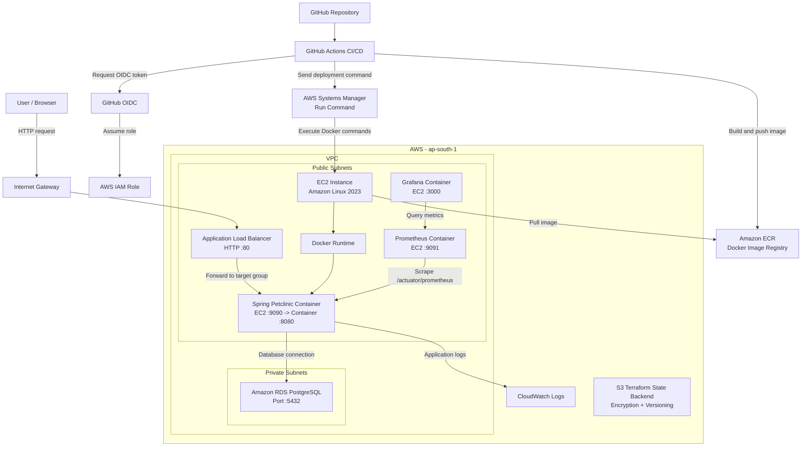

# Architecture Diagram

This diagram shows the high-level flow of the deployed DevOps assignment.



## Explanation

- Users access the application through the internet-facing Application Load Balancer.
- The Internet Gateway gives public subnets internet connectivity.
- The ALB listens on port 80 and forwards traffic to the application running on EC2 port 9090.
- Docker maps EC2 port 9090 to the Spring Boot container port 8080.
- RDS PostgreSQL is placed in private subnets and accepts traffic only from the application layer.
- GitHub Actions builds the Docker image and pushes it to Amazon ECR.
- GitHub Actions uses OIDC to assume an AWS IAM role instead of storing AWS access keys.
- Deployment is done through AWS Systems Manager Run Command instead of SSH.
- Prometheus scrapes application metrics from `/actuator/prometheus`.
- Grafana visualizes the metrics collected by Prometheus.
- Application logs are sent to CloudWatch Logs.
- Terraform state is stored remotely in S3 with encryption and versioning.

## Interview Summary

The application entry path is:

```text
User -> Internet Gateway -> ALB:80 -> EC2:9090 -> Docker container:8080
```

The deployment path is:

```text
GitHub Actions -> OIDC/IAM -> ECR -> SSM -> EC2 Docker container
```

The monitoring and logging path is:

```text
Application metrics -> Prometheus -> Grafana
Application logs -> CloudWatch Logs
```
