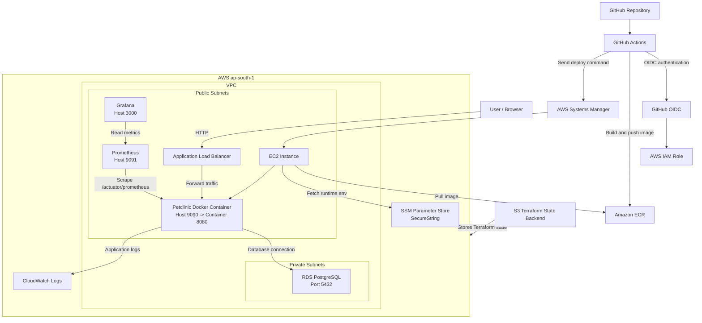
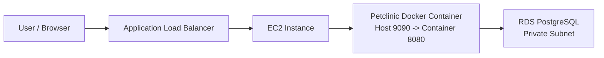
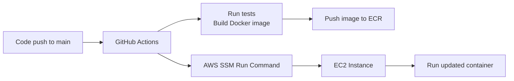
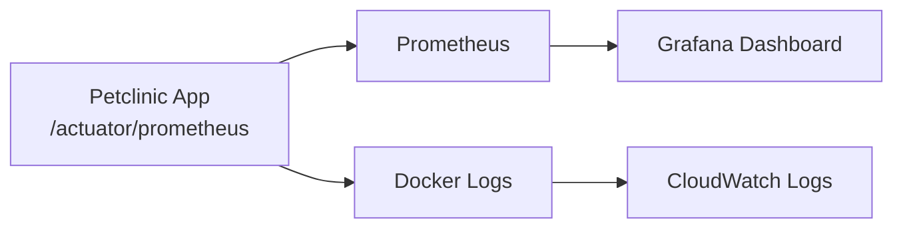

# Architecture

This project deploys a Dockerized Spring Boot Petclinic application on AWS. Terraform creates the infrastructure, GitHub Actions builds and deploys the application, and monitoring/logging is handled using Prometheus, Grafana, and CloudWatch.

## High-Level Flow

## Simplified Flow Diagrams

The full diagram above shows all major components together. The smaller diagrams below split the same architecture into runtime, deployment, and monitoring/logging flows.

### Application Runtime Flow

### CI/CD Deployment Flow

### Monitoring and Logging Flow

## Flow Summary

- Users access the application through the Application Load Balancer.
- The ALB forwards traffic to the EC2 instance on port `9090`.
- Docker maps EC2 port `9090` to container port `8080`.
- The application connects to RDS PostgreSQL in private subnets.
- GitHub Actions builds the Docker image and pushes it to ECR.
- Deployment is done through AWS SSM Run Command.
- Runtime configuration is stored in SSM Parameter Store as a `SecureString`.
- Prometheus collects application metrics from `/actuator/prometheus`.
- Grafana reads metrics from Prometheus.
- Application logs are sent to CloudWatch Logs using Docker's `awslogs` driver.
- Terraform state is stored in S3.

## Design Notes

- The setup is intentionally lightweight for assignment and demo use.
- EC2 is used for simple container hosting.
- RDS is kept private for better security.
- SSM is used instead of SSH for deployment.
- In production, EC2 can be moved fully behind the ALB, HTTPS can be added, and Auto Scaling or ECS can be used.
