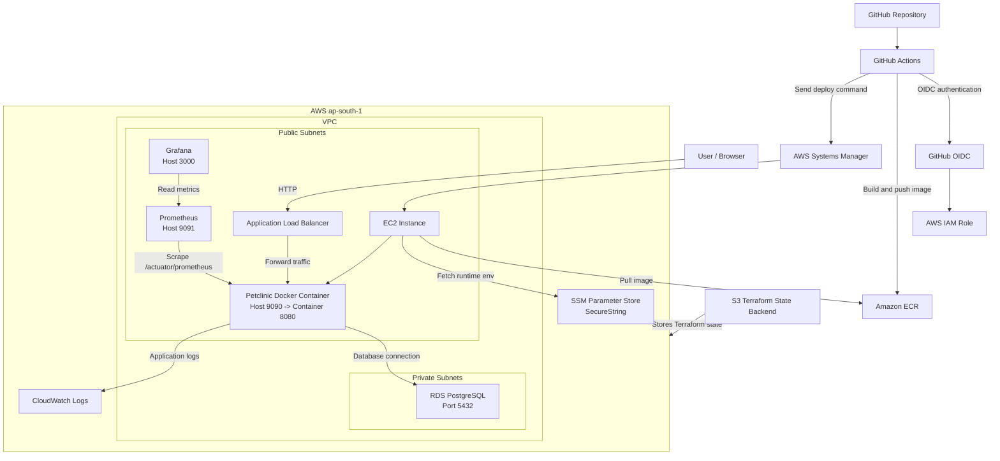
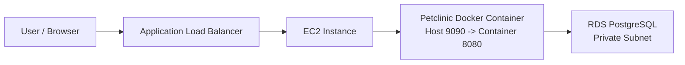
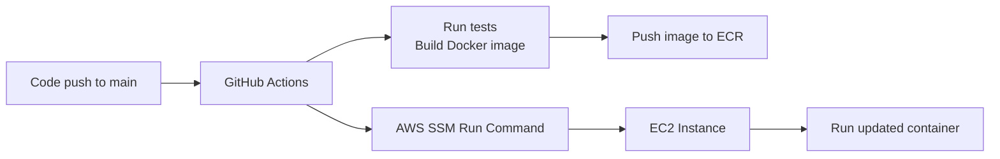
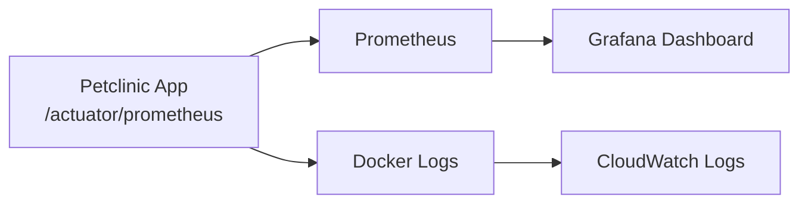

# Architecture

This project deploys a Dockerized Spring Boot Petclinic application on AWS. Terraform creates the infrastructure, GitHub Actions builds and deploys the application, and monitoring/logging is handled using Prometheus, Grafana, and CloudWatch.

## High-Level Flow



## Simplified Flow Diagrams

The full diagram above shows all major components together. The smaller diagrams below split the same architecture into runtime, deployment, and monitoring/logging flows.

### Application Runtime Flow



### CI/CD Deployment Flow



### Monitoring and Logging Flow



## Request Flow

User traffic reaches the Application Load Balancer first. The ALB forwards HTTP traffic to the EC2 instance on port `9090`. Docker maps host port `9090` to container port `8080`, where the Spring Boot application is running.

```text
User -> ALB -> EC2:9090 -> Docker container:8080
```

## Database Flow

The application connects to PostgreSQL running on Amazon RDS. RDS is deployed in private subnets and is not exposed directly to the internet.

```text
Application container -> RDS PostgreSQL:5432
```

## Deployment Flow

GitHub Actions builds the Docker image and pushes it to ECR. The image is tagged using the Git commit SHA. For deployment, GitHub Actions uses AWS SSM Run Command to execute Docker commands on EC2.

```text
GitHub Actions -> ECR -> SSM -> EC2 -> Docker container
```

The workflow finds the current EC2 instance using its `Name` tag, so deployment does not depend on a hardcoded instance ID.

## Secret Management

Application environment variables are stored in AWS SSM Parameter Store as a `SecureString`. During deployment, EC2 fetches the parameter and writes it to `/opt/petclinic/app.env`. The Docker container then starts using this env file.

This keeps secrets out of the repository and makes EC2 replacement easier.

## Monitoring Flow

The application exposes Prometheus metrics using Spring Boot Actuator. Prometheus scrapes `/actuator/prometheus`, and Grafana reads data from Prometheus to display dashboards.

```text
Application metrics -> Prometheus -> Grafana
```

## Logging Flow

The application container sends logs to CloudWatch Logs using Docker's `awslogs` driver.

```text
Application stdout/stderr -> Docker awslogs driver -> CloudWatch Logs
```

## Notes

- The setup is intentionally lightweight for assignment and demo use.
- EC2 is used for simple container hosting.
- RDS is kept private for better security.
- SSM is used instead of SSH for deployment.
- In production, EC2 can be moved fully behind the ALB, HTTPS can be added, and Auto Scaling or ECS can be used.
